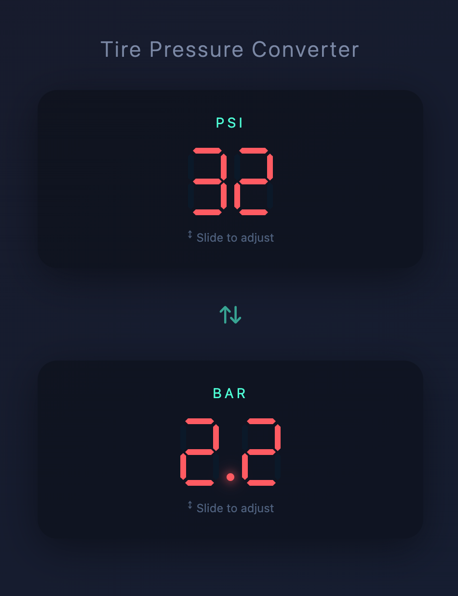

# PSI ↔ BAR Converter

A mobile-friendly tire pressure converter with retro 7-segment LED displays.

## Features

- Bidirectional PSI to BAR conversion
- Touch slide to adjust values on mobile
- Mouse drag and scroll wheel support on desktop
- Swap button to reorder displays

## Usage

Open `index.html` in a browser.

## Value Ranges

- PSI: 0-99 (typical car tires: 25-45)
- BAR: 0.0-6.9 (typical car tires: 1.7-3.1)
